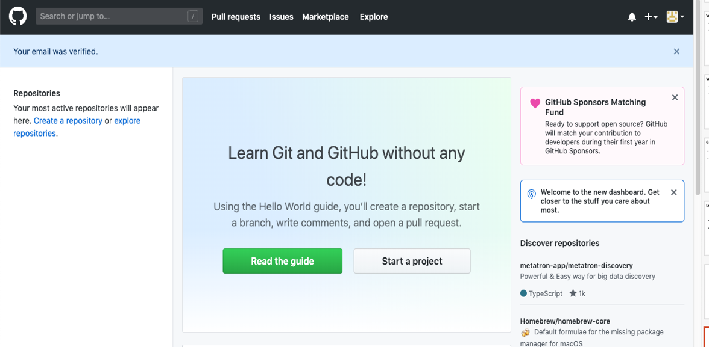
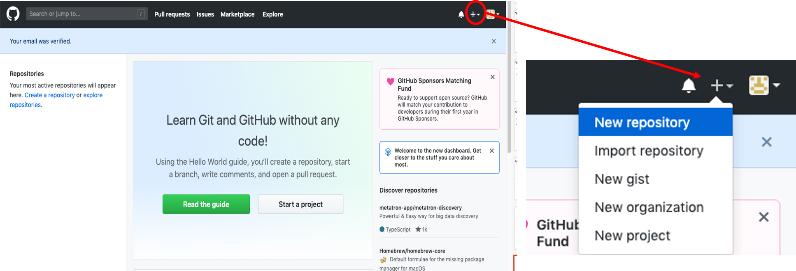
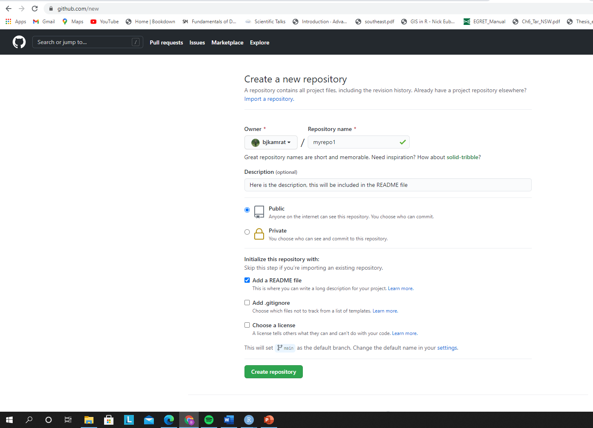
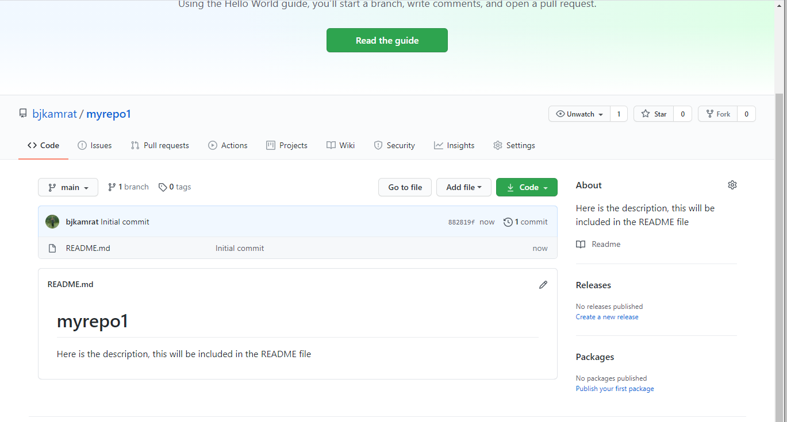
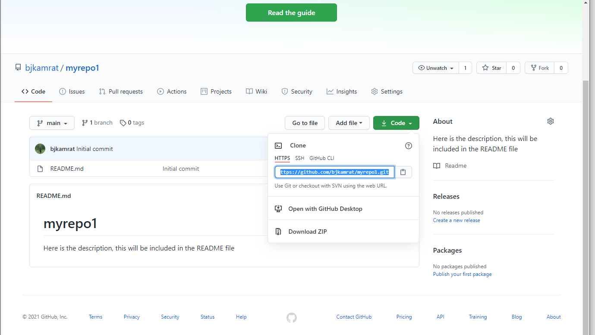
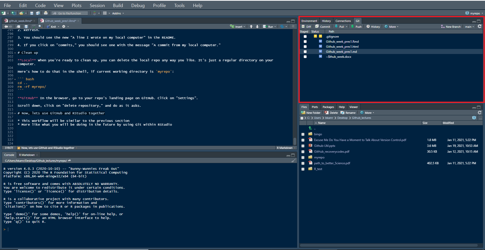
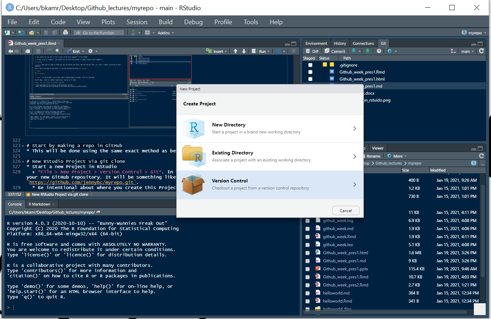
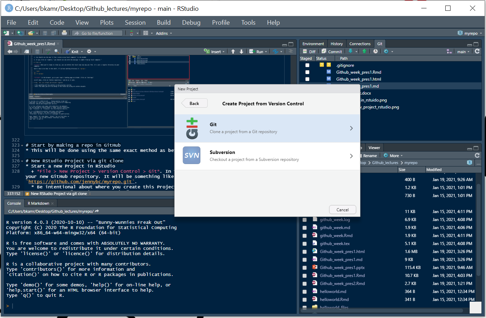
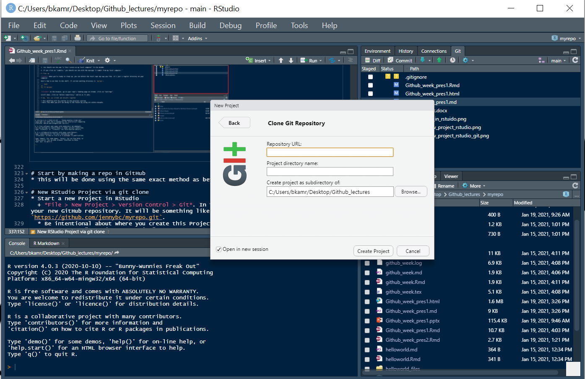

```{r setup, include=FALSE}
knitr::opts_chunk$set(echo = FALSE)
```

# Introduction {.bigger}

Welcome to Version Control week!

```{r logo}
knitr::include_graphics("pres_figs/github_logo2.png")
```

* In our lectures and excercises on version control with GitHub, we will largely utilize 
  + *Happy Git and GitHub for the useR* by Jennifer Bryan @ happygitwithr.com
  + *Introduction to Github* by Lise Montefiore for REEU P4 program

# Today's Schedule {.bigger}

* Discussion of readings
* Troubleshooting the installation of Git/Github/Rstudio
* Important terms and concepts
* Work through two sections of happygitwithr.com
  + Section 2: Connecting Git, GitHub, and RStudio!
  + Section 3: Early Github Wins!

Finish with Chapter 18, there will be some time to work on this at the end of the lecture.

# Discussion
You were asked to read

* Sections 1-4 of Byran article (Excuse Me...)
* Stewart Lowndes et al (Our path...)

*What were your takeaways from the Bryan article?

*What were your takeaways from the Stewart Lowndes article?

# Discussion Questions

**1. What the difference between Git and Github?**

# Discussion Questions

1. What the difference between Git and Github?

**2. In the *Our path...* article, the authors discuss the implementation of version control/reproducibility (via Github and RStudio) in the global OHI assessment. How do you see version control/reproducability being implemented in your research?**

# Discussion Questions

1. What the difference between Git and Github?

2. In the *Our path...* article, the authors discuss the implementation of version control/reproducibility (via Github and RStudio) in the global OHI assessment. How do you see version control/reproducability being implemented in your research?

**3. What do you think will be the largest obstacle to utilizing version control with GitHub?**

# Happy Git and GitHub for the useR

* You all should have
  + A GitHub account with an acceptable user name
  + Upgraded your RStudio to 4.0.3
  + Installed and introduced yourself to Git (i.e completed *Section 1: Installation*)


# To start today's lecture, I want to give a brief overview of the shell

* The [`shell`](https://happygitwithr.com/shell.html) is a program that allows you to run programs on your computer
  + Similar to “terminal”, “command line”, and “console"

You can launch a shell from RStudio. This is often handy, because RStudio makes every effort to put you in a sane working directory, i.e. in the current project.

  * *Tools > Terminal* launches a shell within RStudio, graphically and process-wise. 
    + This is usually what you want.


# Basic Shell Commands

* [`pwd`](https://en.wikipedia.org/wiki/Pwd) (**p**rint **w**orking **d**irectory). 
  + Shows directory or "folder" you are currently operating in.
* [`ls`](https://en.wikipedia.org/wiki/Ls) (**l**i**s**t files). 
  + Shows the files in the current working directory. This is equivalent to looking at the files in your Finder/Explorer/File Manager.
* [`cd`](https://en.wikipedia.org/wiki/Cd_(command)) (**c**hange **d**irectory). 
  + Allows you to navigate through your directories by changing the shell's working directory. You can navigate like so:
  - go to subdirectory `foo` of current working directory: `cd foo`
  - go to parent of current working directory: `cd ..`
  - go to your "home" directory: simply `cd`

* Use arrow-up and arrow-down to repeat previous commands. Or search for previous commands with `CTRL` + `r`.

# Chapter 9: Connect to GitHub

Objective: Make sure that you can all pull from and push to GitHub on your local computer

* Order of operation
  1. Connect to GitHub
  2. Make a repository (or repo) on GitHub
  3. Clone the repo to your local computer (or remote)
  4. Make a local change, commit, and push
  5. Confirm local change propagated to the GitHub remote
  6. Clean up

# Connect to GitHub

* Start by going to <https://github.com> and logging in



# Make a repo on GitHub

Click the plus, then the "New repository" button.



# Make a repo on GitHub 
:::::::::::::::{.columns}
:::{.column}
* How to fill this in:
  + Repository name: `myrepo` (or whatever you wish, we'll delete this soon anyway).
  + Description: "testing my setup" (or whatever, but some text is good for the README).
  + Public.
  + YES Initialize this repository with a README.
* For everything else, just accept the default.
* Click big green button "Create repository."
:::

:::{.column}

:::
:::::::::::::::

# Make a repo on GitHub



# Clone the repo to your local computer

Copy the HTTPS clone URL to your clipboard via the green "Clone or Download" button.




# Clone the repo to your local computer

* Go to Tools > Terminal > New Terminal
  + Pay attention to the directory you're in!
  + Use `pwd` to display the working directory, if not already displayed.
  + Use `cd` to change directory.

* Clone `myrepo` from GitHub to your computer. 
  + This URL should have **your GitHub username** and the name of **your practice repo**.
  + Should be able to paste the copied HTTPS from Clone

``` bash
git clone https://github.com/YOUR-USERNAME/YOUR-REPOSITORY.git
```

# Clone the repo to your local computer

This should look something like this:

``` bash
Cloning into 'myrepo'...
remote: Enumerating objects: 3, done.
remote: Counting objects: 100% (3/3), done.
remote: Compressing objects: 100% (2/2), done.
remote: Total 3 (delta 0), reused 0 (delta 0), pack-reused 0
Receiving objects: 100% (3/3), done.

```
# Clone the repo to your local computer

* Make this new repo your working directory

``` bash
$ cd myrepo
```

* List its files
``` bash
$ ls 
README.md
```
* Display the README
``` bash
$ head README.md
# myrepo
tutorial devlopment
```

# Clone the repo to your local computer

* Now get some information on its connection to GitHub

``` bash
git remote show origin
```

This should look something like this:

``` bash
* remote origin
  Fetch URL: https://github.com/bjkamrat/myrepo1.git
  Push  URL: https://github.com/bjkamrat/myrepo1.git
  HEAD branch: main
  Remote branch:
    main tracked
  Local branch configured for 'git pull':
    main merges with remote main
  Local ref configured for 'git push':
    main pushes to main (up to date)
```

# Make a local change, commit, and push

Add a line to README and verify that Git notices the change:

``` bash
echo "A line I wrote on my local computer" >> README.md
git status
```

This should look something like this:

``` bash
On branch main
Your branch is up to date with 'origin/main'.

Changes not staged for commit:
  (use "git add <file>..." to update what will be committed)
  (use "git restore <file>..." to discard changes in working directory)
        modified:   README.md

no changes added to commit (use "git add" and/or "git commit -a")
```

# Make a local change, commit, and push

::::::::::::::{.columns}
:::{.column}
* Stage ("add") and commit this change
* Push to your remote repo on GitHub. 
  + *If you're a new GitHub user, you will be challenged for your GitHub username and password. Provide them!*

``` bash
git add -A
git commit -m "A commit from my local computer"
git push
```

Note: `-m "blah blah blah"` piece is very important
  + It adds the required commit message to the commit
:::
:::{.column}
This should look something like this:

``` bash
$ git add -A
warning: LF will be replaced by CRLF in README.md.
The file will have its original line endings in your working directory

$ git commit -m "A commit from my local computer"
[main be70f46] A commit from my local computer
 1 file changed, 1 insertion(+)
 
$ git push
Enumerating objects: 5, done.
Counting objects: 100% (5/5), done.
Delta compression using up to 8 threads
Compressing objects: 100% (2/2), done.
Writing objects: 100% (3/3), 346 bytes | 346.00 KiB/s, done.
Total 3 (delta 0), reused 0 (delta 0), pack-reused 0
To https://github.com/bjkamrat/myrepo1.git
   882819f..be70f46  main -> main
```
:::
::::::::::::::


# Confirm local change propgated to GitHub

1. Go back to the browser. I assume we're still viewing your new GitHub repo.

2. Refresh.

3. You should see the new "A line I wrote on my local computer" in the README.

4. If you click on "commits," you should see one with the message "A commit from my local computer."

# Clean up

**Local** When you're ready to clean up, you can delete the local repo any way you like. It's just a regular directory on your computer.

Here's how to do that in the shell, if current working directory is `myrepo`:

``` bash
cd ..
rm -rf myrepo/
```

**GitHub** In the browser, go to your repo's landing page on GitHub. Click on "Settings".

Scroll down, click on "delete repository," and do as it asks.

# Now, lets use GitHub and RStudio together (Chapter 15)

* This workflow will be similar to the previous section
* More like what you will be doing in the future by using Git within RStudio



# Start by making a repo in GitHub
* This will be done using the same exact method as before
* Remember
  + Repository name: `myrepo` (or whatever you wish, we'll delete this soon anyway).
  + Description: "testing my setup" (or whatever, but some text is good for the README).
  + Public.
  + YES Initialize this repository with a README.
* For everything else, just accept the default.
* Click big green button "Create repository."

# New RStudio Project via git clone

::::::::::{.columns}
:::{.column}
* Start a new Project in RStudio
  + *File > New Project > Version Control > Git*. 
  + In the "repository URL" paste the URL of your new GitHub repository. 
    + `https://github.com/bjkamrat/myrepo.git`
* Be intentional about where you create this Project.
* Suggest you "Open in new session".
* Click "Create Project" to create a new directory, which will be:
  + a directory or "folder" on your computer
  + a Git repository, linked to a remote GitHub repository
  + an RStudio Project
:::
:::{.column}



:::
::::::::::::::

* **All of your R projects should have this set-up.**

# New RStudio Project via git clone

* The `README.md` file that we created on GitHub in the previous step should be there.
  + Look in RStudio's file browser pane for the `README.md` file.

* There's a big advantage to the "GitHub first, then RStudio" workflow
  + The remote GitHub repo is added as a remote for your local repo and your local `master` branch is now tracking `master` on GitHub. 
  + This is a technical but it means that you are now set up to push and pull.
  
# Make local changes, save, commit

**Do this every time you finish a valuable chunk of work, probably many times a day.**

* In RStudio, open and modify the `README.md` file, by adding the line "This is a line from RStudio". Save your changes.

* Commit these changes to your local repo.
  1. Click the "Git" tab in upper right pane (Note: Environment|History|Connections|Git)
  2. Check "Staged" box for any files whose existence or modifications you want to commit.
    -  click on "Diff" for a Git pop-up of changes made
  3. If you're not already in the Git pop-up, click "Commit"
  4. Type a message in "Commit message", such as "Commit from RStudio".
  5. Click "Commit"

# Push your local changes to GitHub

**Do this a few times a day, but possibly less often than you commit.**

* At this point your changes have been made at the local level, but not pushed online yet.

What do we need to do?
1. let's stop and pull from GitHub.
  + Click the blue "Pull" button. 
  + You should get the message "Already up-to-date."
  + Why? 
    + Establish this habit
    + If you make changes to the repo in the browser or from another machine or (one day) a collaborator has pushed, you will be happier if you pull those changes in before you attempt to push.
  
2. Push your local changes to GitHub
  + Click the green "Push" button  
  + You should see some message along these lines.

``` bash
[master dc671f0] blah
 3 files changed, 22 insertions(+)
 create mode 100644 .gitignore
 create mode 100644 myrepo.Rproj
```
You have now pushed a change on you local computer to GitHub!

# Confirm the local change propagated to the GitHub remote

* Go back to the browser. I assume we're still viewing your new GitHub repo.
* Refresh.
* You should see the new "This is a line from RStudio" in the README.
  + If you click on "commits," you should see one with the message "Commit from RStudio".

# Make a change on GitHub

1. Click on README.md in the file listing on GitHub.
  + In the upper right corner, click on the pencil for "Edit this file".
2. Add a line to this file, such as "Line added from GitHub."
3. Edit the commit message in "Commit changes" or accept the default.
4. Click the big green button "Commit changes."

# Now, Pull the updated repo from GitHub to local computer

So, Back in RStudio

1. Inspect your README.md. 
  + It should NOT have the line "Line added from GitHub". It should be as you left it.

2. Click the blue Pull button.
  + Look at README.md again. You should now see the new line there.

# For the future

Now just ... repeat. Do work somewhere. Commit it. Push it or pull it\* depending on where you did it, but get local and remote "synced up". Repeat.

\* Note that in general (and especially in future when collaborating with other developers) you will usually need to pull changes from the remote (GitHub) before pushing the local changes you have made. For this reason, it's a good idea to try and get into the habit of pulling before you attempt to push.

# Coursework for this week

With the rest of the class period, I would like you to begin working through chapters 16, 17, and 18 from happygitwithr.com

For Thursday (2/4/21), you need to

* Complete chapters 16, 17, and 18 
* Finish reading Byran article (Excuse Me...)

On Thursday, we will

* Go over any questions
* Get more into GitHub basics
* Work through some additional material
* Then begin an exercise due next Tuesday (2/9/21)
