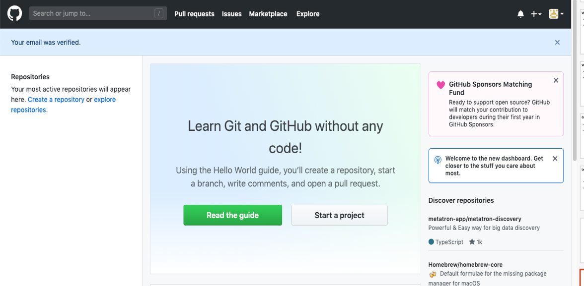
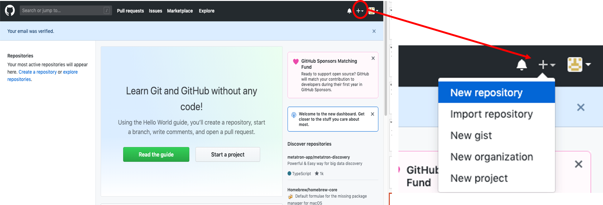
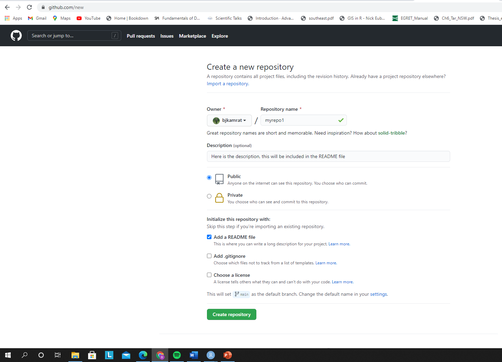

# Introduction {.bigger}

Welcome to Version Control week!


* In our lectures and excercises on version control with GitHub, we will largely utilize:
  + *Happy Git and GitHub for the useR* by Jennifer Bryan @ happygitwithr.com
  + *Introduction to Github* by Lise Montefiore for REEU P4 program
  + *Git for Humans* by Alice Bartlet

# Today's Schedule {.bigger}

* Article Discussion Questions
* Discussion of Terminal and Git
* Important terms and concepts
* Work through Chapter 12 of happygitwithr.com
* Start Chapter 15, there will be some time to work on this at the end of the lecture.

# Discussion
You were asked to read

* Sections 1-4 of Byran article (Excuse Me...)
* Stewart Lowndes et al (Our path...)

*What were your takeaways from the Bryan article?

*What were your takeaways from the Stewart Lowndes article?

# Discussion Questions

**1. What the difference between Git and Github?**

# Discussion Questions

1. What the difference between Git and Github?

**2. In the *Our path...* article, the authors discuss the implementation of version control/reproducibility (via Github and RStudio) in the global OHI assessment. How do you see version control/reproducability being implemented in your research?**

# Discussion Questions

1. What the difference between Git and Github?

2. In the *Our path...* article, the authors discuss the implementation of version control/reproducibility (via Github and RStudio) in the global OHI assessment. How do you see version control/reproducability being implemented in your research?

**3. What do you think will be the largest obstacle to utilizing version control with GitHub?**

# Happy Git and GitHub for the useR

* You all should have
  + Created your NCSU GitHub account
  + Upgraded RStudio to version 4.0
  + Installed and introduced yourself to Git (i.e completed *Section 1: Installation*)


# To start today's lecture

* Git is program for version control of software
  * It was not built to be user friendly!

* GitHub is the user friendly remote hosting site

* The Git extension in RStudio allows for a user friendly GUI

# You can interact with Git from the Terminal/Shell

* The [`shell`](https://happygitwithr.com/shell.html) is a program that allows you to run programs on your computer
  + Similar to “terminal”, “command line”, and “console"

You can launch a shell from RStudio. This is often handy, because RStudio makes every effort to put you in a same working directory, i.e. in the current project.

  * *Tools > Terminal* launches a shell within RStudio, graphically and process-wise. 
    + This is usually what you want.


# Basic Shell Commands

* [`pwd`](https://en.wikipedia.org/wiki/Pwd) (**p**rint **w**orking **d**irectory). 
  + Shows directory or "folder" you are currently operating in.
* [`ls`](https://en.wikipedia.org/wiki/Ls) (**l**i**s**t files). 
  + Shows the files in the current working directory. This is equivalent to looking at the files in your Finder/Explorer/File Manager.
* [`cd`](https://en.wikipedia.org/wiki/Cd_(command)) (**c**hange **d**irectory). 
  + Allows you to navigate through your directories by changing the shell's working directory. You can navigate like so:
  - go to subdirectory `foo` of current working directory: `cd foo`
  - go to parent of current working directory: `cd ..`
  - go to your "home" directory: simply `cd`

* Use arrow-up and arrow-down to repeat previous commands. Or search for previous commands with `CTRL` + `r`.

# Chapter 12: Connect RStudio to Git and GitHub

## Objectives: 
1. Make sure that you can all pull from and push to GitHub in RStudio on your local computer
2. Use RStudio to edit, commit, and push to your remote GitHub repo

## Order of operation
  1. Connect to GitHub
  2. Make a repository (or repo) on GitHub
  3. Clone the repo to your local computer via RStudio
  4. Make a local change, commit, and push
  5. Confirm local change propagated to the GitHub remote
  6. Clean up

# Connect to GitHub

* Start by going to <https://github.com> and logging in



# Make a repo on GitHub

Click the plus, then the "New repository" button.



# Make a repo on GitHub 
:::::::::::::::{.columns}
:::{.column}
* How to fill this in:
  + Repository name: `myrepo` (or whatever you wish, we'll delete this soon anyway).
  + Description: "testing my setup" (or whatever, but some text is good for the README).
  + Public.
  + YES Initialize this repository with a README.
* For everything else, just accept the default.
* Click big green button "Create repository."
:::

:::{.column}

:::
:::::::::::::::

# Make a repo on GitHub


# Clone the repo to your local computer

Copy the HTTPS clone URL to your clipboard via the green "Clone or Download" button.


# Clone the new GitHub repo to your local computer via RStudio

::::::::::{.columns}
:::{.column}
* Start a new Project in RStudio
  + *File > New Project > Version Control > Git*. 
  + In the "repository URL" paste the URL of your new GitHub repository. 
    + `https://github.com/bjkamrat/myrepo.git`
* Be intentional about where you create this Project.
* Check "Open in new session
* Click "Create Project" to create a new directory, which will be:
  + a directory or "folder" on your computer
  + a Git repository, linked to a remote GitHub repository
  + an RStudio Project
  
:::
:::{.column}


:::
::::::::::::::

* **All of your R projects should have this set-up.**
  
* The new local RStudio Project should represent the new test remote repo created on GitHub

# Make a local change, commit, and push

In your local RStudio Project modify the `README.md` file
  + Add the line "This is a line from RStudio"
  + Save your change

# Now, commit these changes to your local repo. How?

In RStudio:

* Click the "Git" tab in upper right pane.
* Click the white "Staged" box for `README.md`.
* Click "Commit".
* "Comment" on your "commit"! 
  + "Commit message", such as "Commit from RStudio".
* Click "Commit".


  
## Pull then Push your local changes online to GitHub

* First, Pull into RStudio the most updated verison of the GitHub Repo
  + You should see some message...
  
``` bash
Already up to date.
```

* Click the green "Push" button to send your local changes to GitHub. If you are challenged for username and password, provide them
  + You should see some message..

``` bash
[master dc671f0] blah
 3 files changed, 22 insertions(+)
 create mode 100644 .gitignore
 create mode 100644 myrepo.Rproj
```

# Workflow

Do work somewhere. Commit it. Push it or pull it\* depending on where you did it, but get local and remote "synced up". Repeat.

\* Note that in general (and especially in future when collaborating with other developers) you will usually need to pull changes from the remote (GitHub) before pushing the local changes you have made. For this reason, it's a good idea to try and get into the habit of pulling before you attempt to push.

# Confirm local change propgated to GitHub

1. Go back to the browser. I assume we're still viewing your new GitHub repo.

2. Refresh.

3. You should see the new "This is a line from RStudio" in the README.

4. If you click on "commits," you should see one with the message "Commit from Rstudio"

# Clean up

**Local** 
  * When you're ready to clean up, you can delete the local repo any way you like. It's just a regular directory on your computer.


**GitHub** 
  * In the browser, go to your repo's landing page on GitHub. Click on "Settings".
  * Scroll down, click on "delete repository," and do as it asks.

# 


# Before moving on, lets discuss some of the Git methodology/terminology

* Git allows you to take snapshots of all the files in a folder
 * This folder is your *repository* or *repo*
 
* When you *commit*, you take a snapshot, which you then *push* to Github with a comment
  * Think of taking a picture (*commit*) then posting (*pushing*) the picture to instagram
    * and you wouldn't post a picture to instagram without a *comment*


# Git methodology/terminology

* When you *commit* a file or files, additional information is saved along with the changes to the file
  + Who
  + When
  + What was changed
  + A comment on the change
  
# Git methodology/terminology

These snapshots act as version control


# Git methodology/terminology

These snapshots act as version control


# Git methodology/terminology

These snapshots act as version control


# Git methodology/terminology

* Git, or in our case GitHub, stores the history of your project
  + This lets you time travel to different versions of your project
  + you can *check out* these older versions of the project

# Git methodology/terminology

* What if you want to experiment with making some changes to files in your project?
  + you can do this by creating a *branch*

* A *branch* is a moveable label attached to a commit


# Git methodology/terminology

* The default *branch* name in GitHub is *master*
  - To experiment with making some changes created a new *branch*
  - If you are happy with the changes you can *merge* them back into the *master*

* In collaborative projects
  + most changes should be done in a new *branch*
  + the *master* *branch* is often the verison of the code that is published on a site

# Git methodology/terminology

* As you know, it is always good to back up your work
  + Typically, not on your local computer

* This outside storage location is called a *remote*
  + GitHub is one very popular *remote*

# Git methodology/terminology

* To get work from a *remote* for the first time you must *clone* it to your local computer
   _ We just did this!!

* If you make a change at the local level, 
  1. You can *commit* the change
  2. Then *push* it back to the remote
  3. For someone else to have the most updated repo, they now need to *pull* your changes to their local computer
  
# Summary

*repo* - your project folder

*commit* - snapshot of repo

*checkout* - time travel to specific commit

*branch* - a moveable label that point to a commit

*merge* - combining two branches

*remote* - a computer/server with the repository on it

*clone* - the first time you get the repo from the remote

*push* - send commits (with comments) to a remote

*pull* - get updated repo from a remote

* Haven't yet discussed
* *fork* or *pull request* or *upstream*

#


# Now, lets use GitHub and RStudio together (Chapter 15)

* This workflow will be similar to the previous section
* More like what you will be doing in the future by using Git within RStudio

# Start by making a repo in GitHub
* This will be done using the same exact method as before
* Remember
  + Repository name: `myrepo` (or whatever you wish, we'll delete this soon anyway).
  + Description: "testing my setup" (or whatever, but some text is good for the README).
  + Public.
  + YES Initialize this repository with a README.
* For everything else, just accept the default.
* Click big green button "Create repository."


# From here

* With the rest of the class period, I would like you to work on CH 15 and go through CH 16 and 17.

For Thursday (2/4/21), you need to

* Complete Chapter 15
* Finish reading Byran article (Excuse Me...)
