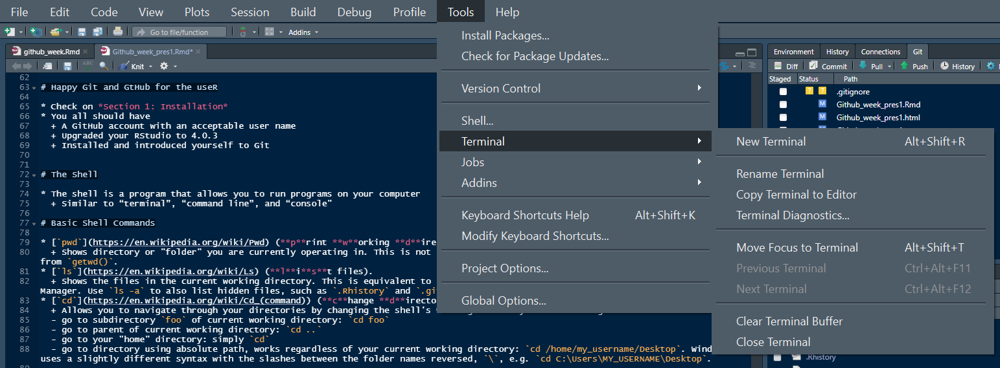

# Introduction {.bigger}

Welcome to Version Control week!

* In our lectures and excercises on version control with GitHub, we will largely utilize 
  + *Happy Git and GitHub for the useR* by Jennifer Bryan @ happygitwithr.com
  + *Introduction to Github* by Lise Montefiore for REEU P4 program

# Today's Schedule {.bigger}

* Discussion of readings
* Troubleshooting the installation of Git/Github/Rstudio
* Important terms and concepts
* Work through two sections of happygitwithr.com
  + Section 2: Connecting Git, GitHub, and RStudio!
  + Section 3: Early Github Wins!

Finish with Chapter 18, there will be some time to work on this at the end of the lecture.

# Discussion
You were asked to read

* Sections 1-4 of Byran article (Excuse Me...)
* Stewart Lowndes et al (Our path...)

*What were your takeaways from the Bryan article?

*What were your takeaways from the Stewart Lowndes article?

# Discussion Questions

**1. What the difference between Git and Github?**

# Discussion Questions

1. What the difference between Git and Github?

**2. In the *Our path...* article, the authors discuss the implementation of version control/reproducibility (via Github and RStudio) in the global OHI assessment. How do you see version control/reproducability being implemented in your research?**

# Discussion Questions

1. What the difference between Git and Github?

2. In the *Our path...* article, the authors discuss the implementation of version control/reproducibility (via Github and RStudio) in the global OHI assessment. How do you see version control/reproducability being implemented in your research?

**3. What do you think will be the largest obstacle to utilizing version control with GitHub?**

# Happy Git and GitHub for the useR

* Check on *Section 1: Installation*
* You all should have
  + A GitHub account with an acceptable user name
  + Upgraded your RStudio to 4.0.3
  + Installed and introduced yourself to Git

# The Shell 

* The [`shell`](https://happygitwithr.com/shell.html) is a program that allows you to run programs on your computer
  + Similar to “terminal”, “command line”, and “console"

You can launch a shell from RStudio. This is often handy, because RStudio makes every effort to put you in a sane working directory, i.e. in the current project.

  * *Tools > Terminal* launches a shell within RStudio, graphically and process-wise. 
    + This is usually what you want.

# Basic Shell Commands

* [`pwd`](https://en.wikipedia.org/wiki/Pwd) (**p**rint **w**orking **d**irectory). 
  + Shows directory or "folder" you are currently operating in.
* [`ls`](https://en.wikipedia.org/wiki/Ls) (**l**i**s**t files). 
  + Shows the files in the current working directory. This is equivalent to looking at the files in your Finder/Explorer/File Manager.
* [`cd`](https://en.wikipedia.org/wiki/Cd_(command)) (**c**hange **d**irectory). 
  + Allows you to navigate through your directories by changing the shell's working directory. You can navigate like so:
  - go to subdirectory `foo` of current working directory: `cd foo`
  - go to parent of current working directory: `cd ..`
  - go to your "home" directory: simply `cd`

* Use arrow-up and arrow-down to repeat previous commands. Or search for previous commands with `CTRL` + `r`.

# Ch 9 Connect to GitHub

Objective: Make sure that you can all pull from and push to GitHub on your local computer (remote)

Start with making a repository

# 

