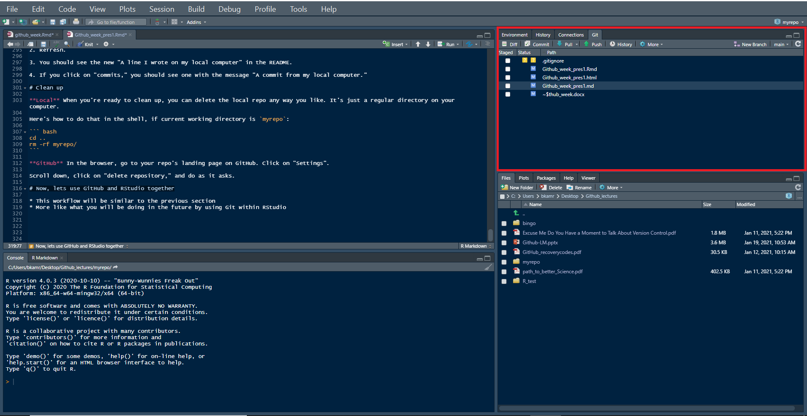

```{r setup, include=FALSE}
knitr::opts_chunk$set(echo = FALSE)
```

# Introduction {.bigger}

Welcome to Version Control week!

```{r logo}
knitr::include_graphics("pres_figs/github_logo2.png")
```

In our lectures and excercises on version control with GitHub, we will largely utilize 
  + *Happy Git and GitHub for the useR* by Jennifer Bryan @ happygitwithr.com
  + *Introduction to Github* by Lise Montefiore for REEU P4 program


# Today's Schedule {.bigger}

* Article discussion
* Work through Chapter 18: Test drive R Markdown
* Discussion on Workflow (markdown files instead of .docx files) and general questions
* Present and discuss excerise to be due the following Tuesday 2/9/21

# Discussion Questions

**1. What have you found to be the most challenging aspect of GitHub and Version Control?**

# Discussion Questions

1. What have you found to be the most challenging aspect of GitHub and Version Control?

**2. What are your biggest concerns about using GitHub and RMarkdown for homework and future collaboration?**

# Git/GitHub and RStudio is suited to R Markdown file for reports

* If you are anything like me, when you write a report you immediately open MS Word.
* However, version control with GitHub and RStudio is suited for using R and RMarkdown files


Here is the official [R Markdown documentation](http://rmarkdown.rstudio.com)
Here is the [R Markdown cheatsheet](https://rstudio.com/wp-content/uploads/2015/02/rmarkdown-cheatsheet.pdf)


# What else you do in R Markdown

* Presentations
* Handouts
* Interactive reports
* Books
* Blogs
* Websites
* Correctly-formatted journal articles
  - With formulas
  $$\sum_{i=0}^n i^2 = \frac{(n^2+n)(2n+1)}{6}$$
  
# Go through a example using CH: 18
* In your *myrepo* repository, We will
  - Author an R Markdown document
  - Render it to a markdown file
  - Commit and push to GitHub
  

# Workflows - RMarkdown

1. Create a new R markdown file

2. Edit the output format
  * if using GitHub to host file, then set `output: github_document` or add a `keep_md: true`
  * By making `foo.Rmd` available, others can see and run your __actual code__. 
  * By sharing `foo.md` and/or `foo.html`, others can casually browse your end product and decide if they even want to bother

3. Work on the report/document/presentation
  * Add code in chunks. Refine it. Add new chunks. Go crazy!
  * Keep running the code "manually" to make sure it works.
  
4. Save, then knit

5. Commit the files to GitHub (with a comment)

6. Push to your GitHub repository

7. View in GitHub

# Workflows - Fork and Clone

* You know how to clone, commit, push, and pull from a repo you created in GitHub
* But how do you clone and edit someone else's repository when collaborating

## Fork and Clone!

# Workflows - Fork and Clone

* In GitHub, navigate to the repo of interest
* Click **Fork** (in the upper right hand corner)
 - This creates a repo in your GitHub account
* **Clone** the forked repo (aka your copy of the repo) into your GitHub remote to your local computer
  - We have done this before


# Workflows - fork and clone

* Now you can engage with the new repo

* If you want the owner of the original repo to add your work, submit a *pull request*
  - *pull request* - you are requesting that they pull in your work

* **BUT**
  
## Dont mess with the `master`!
* Work in a new branch!
* Do not make commits to the master of a repo that you forked
 - The owner of the repo will be happier to recieve a *pull request* from a non-master branch
 


# Workflows - fork and clone

* In order to keep your copied repo up-to-date, you need to get the upstream changes
* This will need to be done in the terminal

* First, list your remotes
  - Let's inspect [the current remotes](#git-remotes) for your local repo. In the shell (Appendix \@ref(shell)):

``` bash
git remote -v
```
* We need to add the `upstream` remote

# Workflows - upstream remote

* Let us add `OWNER/REPO` as the `upstream` remote.

* On [GitHub](https://github.com), make sure you are signed in and navigate to the original repo, `OWNER/REPO`. It is easy to get to from your fork, `YOU/REPO`, via "forked from" links near the top.

* Use the big green "Clone or download" button to get the URL for `OWNER/REPO` on your clipboard. Be intentional about whether you copy the HTTPS or SSH URL.

* Now, click on "New Branch" in the Git pane.



* Click "Add Remote"
  - Enter `upstream` as the remote name
  - paste the URL for `OWNER/REPO` that you got from GitHub. 
  - Click "Add". 
  - Decline the opportunity to add a new branch by clicking "Cancel".

* The nickname `upstream` can technically be whatever you want, however, there is a strong tradition of using `upstream`

# Workflows - verify upstream remote

Let's inspect [the current remotes](#git-remotes) for your local repo AGAIN. In the shell:

``` bash
git remote -v
```

Now you should see something like

``` bash
origin    https://github.com/YOU/REPO.git (fetch)
origin    https://github.com/YOU/REPO.git (push)
upstream  https://github.com/OWNER/REPO.git (fetch)
upstream  https://github.com/OWNER/REPO.git (push)
```

Notice the second remote, named `upstream`, corresponding to the original repo on GitHub. We have gotten to this:


# Pull changes from `upstream`

Now we can pull the changes that we don't have from `OWNER/REPO` into our local copy.


``` bash
git pull upstream master --ff-only
```

* This says: "pull the changes from the remote known as `upstream` into the `master` branch of my local repo". 
  - We are being explicit about the remote and the branch in this case, because the `upstream/master` is **not** the default tracking branch for local `master`.

* I **highly recommend** using the `--ff-only` flag


# Those are the basics in Git, GitHub, and RStudio

Now lets get to work on an exercise!

# Class exercise


